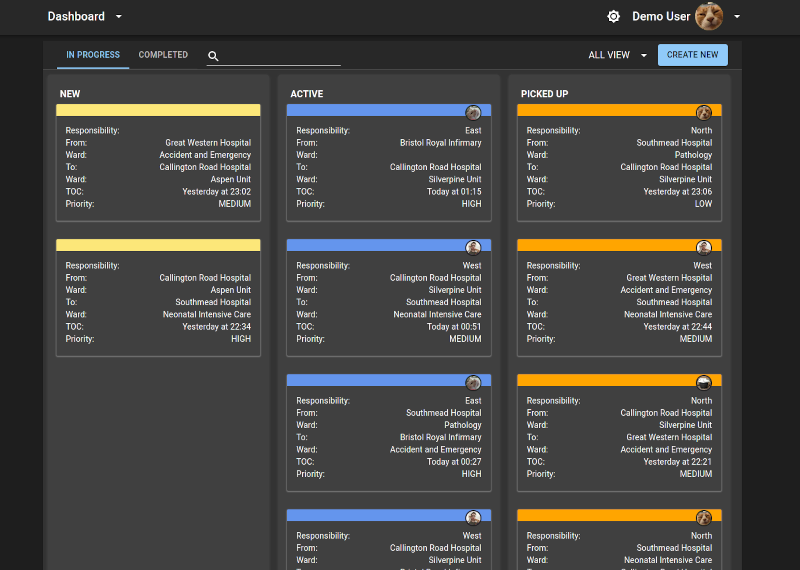
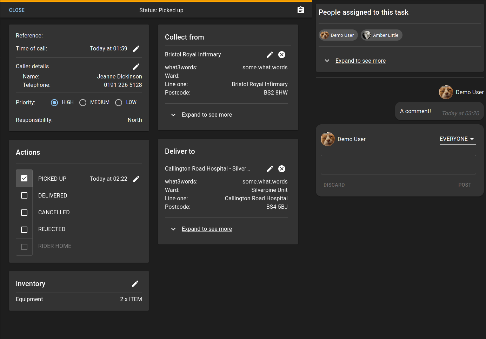

Platelet is the only open source and cloud backed dispatch software for couriers and coordinators. It is being developed for Blood Bikers in the UK, but can be used for any delivery tracking.

[Demo](https://demo.platelet.app)

[Homepage](https://platelet.app)

Some of Platelet's goals are:

- Provide a robust service for recording assignment details, synchronized across all devices

- Let volunteers coordinate cross country relays over a wide network of groups

- Focus on ease of use and a smooth user experience

- Provide more detailed tracking information for deliveries

- Allow direct requests for deliveries by external users

- Provide reports and statistics

It can be deployed to AWS using Amplify or can be used fully offline with no online synchronization.

If you're interested in developing on Platelet please take a look at [CONTRIBUTING](CONTRIBUTING.md).
